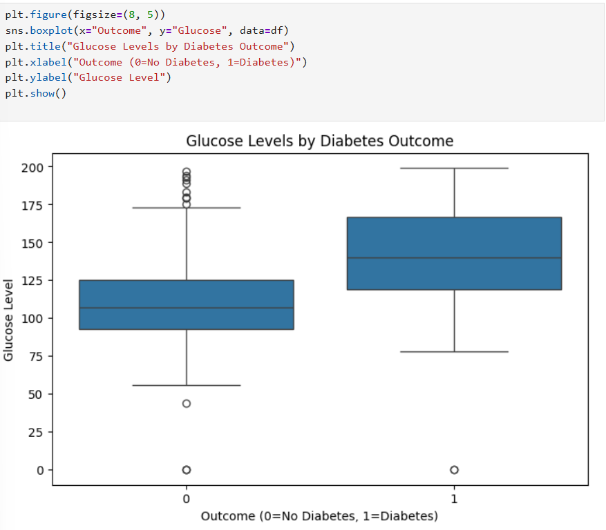
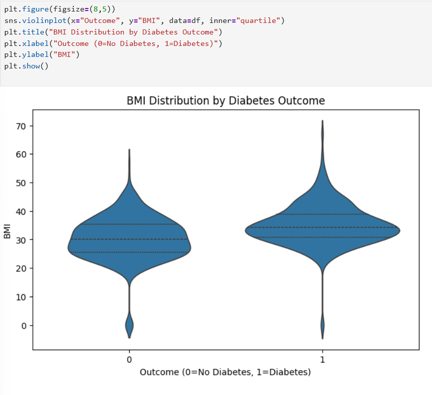
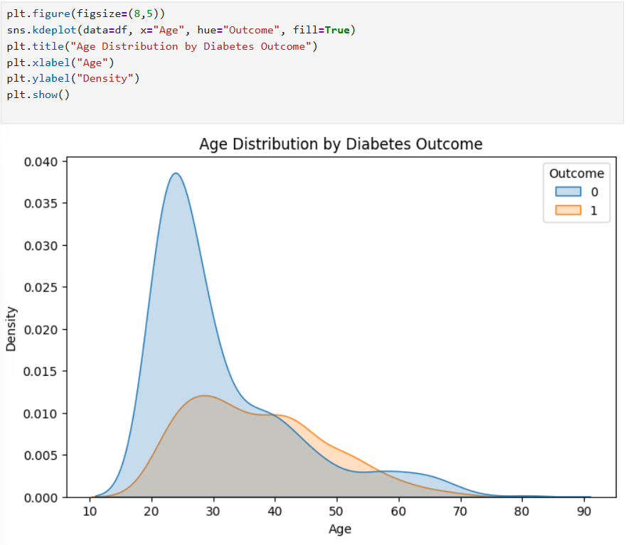
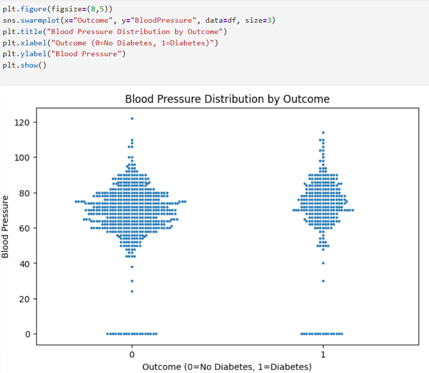

# diabetes-data-visualization

# READ.ME

## Project Description
This project provides data visualization and exploratory data analysis on a diabetes dataset using Python libraries Pandas, Seaborn, and Matplotlib. The dataset contains medical predictor variables and a binary outcome indicating the presence of diabetes.

The goal is to understand patterns and relationships within the dataset through various plots such as bar plots, box plots, violin plots, KDE plots, and swarm plots.

## Dataset
- The dataset is sourced from the kaggle :  
  `diabetes.csv`
- It includes features like Glucose, BMI, Age, Blood Pressure, and Outcome (0 = no diabetes, 1 = diabetes).

## Visualizations and Insights

### 1. Outcome Counts (Bar Plot)  
  
The dataset is imbalanced, with more non-diabetic cases (Outcome=0) than diabetic ones (Outcome=1).

### 2. Glucose Levels by Outcome (Box Plot)  
  
Diabetic individuals tend to have higher glucose levels compared to non-diabetic individuals.

### 3. BMI Distribution by Outcome (Violin Plot)  
  
A higher BMI is associated with a higher probability of diabetes.

### 4. Age Distribution by Outcome (KDE Plot)  
  
Diabetic cases are more frequent among older individuals whereas non-diabetic cases peak at a younger age.

### 5. Blood Pressure by Outcome (Swarm Plot)  
  
Blood pressure distribution is similar across outcomes, but extreme values appear more in the diabetic group.

## How to Run the Project

1. Clone this repository.
2. Ensure you have Python installed (version 3.6+ recommended).
3. Install required libraries (if not already installed):
